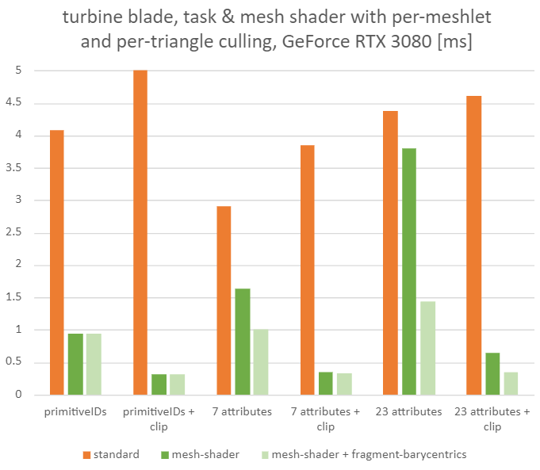

# Vulkan & OpenGL CAD Mesh Shader Sample

This sample demonstrates rendering of models with many triangles using mesh shaders. CAD models frequently have high triangle density and therefore the processing (vertex shading, primitive culling etc.) of the sheer number of primitives can become a challenge. With the [Turing architecture](https://www.nvidia.com/en-us/design-visualization/technologies/turing-architecture/) new shader stages have been introduced that allow a new geometry pipeline based on mesh shading. 

## Introduction


The new pipeline, as shown above, is explained in further detail in this [blog post](https://devblogs.nvidia.com/introduction-turing-mesh-shaders/). We highly recommend going through that material first.

> **Note** This sample currently builds two executables: `gl_meshlet_cadscene` using classic OpenGL Window creation and the `vk_meshlet_cadscene`. one uses WSI and Vulkan. There is also a cmake build option for building only `vk_meshlet_cadscene`. Only the Vulkan application supports both `VK_NV_mesh_shader` and the cross-vendor `VK_EXT_mesh_shader`, the OpenGL application supports `GL_NV_mesh_shader`. For `VK_EXT_mesh_shader` support, make sure that the `shaderc_shared.lib` that is part of the Vulkan SDK actually supports the `GL_EXT_mesh_shader` extension. At the time of release of this updated sample, the SDK might not have this support yet, and you need to build the library yourself or wait a bit.


## Sample Overview

The sample comes with two datasets:
* *worldcar* CAD model courtesy of [PTC](https://www.ptc.com). 
* *turbine blade* 3d scan model courtesy of [Georgia Institute of Technology](https://www.cc.gatech.edu/projects/large_models/).
Pass one of the `cfg` config files as commandline argument to load either model configuration. Both configurations will instance the model a few times to generate some meaningful workloads for benchmarking.

The ui allows you to use different renderers and compare between the classic and the mesh shading pipeline. There are also various tweak-able options to see the performance impact of many configurations.

You can toggle between vsync via *V* key (default is on for debug builds) and via *R* reload the shaders (they must be error-free).

> **NOTE:** Please read the performance section later for further details, as "your mileage may vary". 

### Basic Settings
- **demo scene**: If no custom model is provided via commandline, you can toggle between the two demo scenes.
- **renderer:** Switch between standard or mesh shading, see renderers section further below.
- **viewpoint:** Switch between some pre-configured camera viewpoints.
- **fov:** Camera field of view.

### Mesh Shading Settings
Ideally use numeric inputs as each modification will cause reloading the model, you can also pass many settings via commandline.
- **meshlet vertices:** Maximum number of unique vertices per meshlet
- **meshlet primitives:** Maximum number of triangles per meshlet

- **task meshlet count:** One task shader workgroup operates on this many meshlets at once.
- **task min. meshlets:** Mesh renderers use task *and* mesh stages, if the amount of meshlets per drawcall is greater or equal than this, otherwise, or if set to zero, they use only the mesh stage.
- **task pixel cull:** Influences how aggressive the subpixel cluster culling in the task-shader should be performed. 1 means the full resolution is used, 0.5 means we may cull clusters that are actually visible, but often not noticeable. 

- **mesh colorize by meshlet:** Visualize the triangle clusters in the fragment shader. Only works in mesh renderers.
- **use per-primitive culling:** Enable per-primitive culling in the mesh shader uses `drawmeshlet_*_cull.mesh.glsl` (does not cull based on user clipping plane), otherwise `drawmeshlet_*_basic.mesh.glsl`.
- **- also use per-vertex culling:** If per-primitive culling is used, also enable per-vertex culling to avoid processing vertex outputs of culled vertices. Sets `USE_VERTEX_CULL 1` inside `drawmeshlet_*_cull.mesh.glsl`.
- **use fragment barycentrics:** Enables access to hardware [barycentrics in the fragment shader](https://github.com/KhronosGroup/GLSL/blob/master/extensions/nv/GLSL_NV_fragment_shader_barycentric.txt). This allows to greatly reduce the amount of outputs a mesh-shader has to pass to the fragment shader and can improve the performance. We only pass the vertex indices and then 

### EXT Mesh Shading Preferences
If `VK_EXT_mesh_shader` is supported, this menu is available and allows to influence the EXT task and mesh shader significantly.

Mesh shaders are very sensitive to implementation specific behavior, and ideally these preferences help to get better performance. The values can be queried from the device via `VkPhysicalDeviceMeshShaderPropertiesEXT`. The shaders implicitly try to make use of **local invocation primitive output**, hence the option is not directly exposed here. The UI gives the opportunity to override the vendor's preferences and inspect what the performance behavior is. Except for the workgroup sizes, these preferences affect mostly the complex scenario of per-primitive culling. Be aware that the values returned in `VkPhysicalDeviceMeshShaderPropertiesEXT`, might change with new driver versions, even on the same hardware.

- **RESET to implementation DEFAULTS**: As the name suggests, the following values are reset to those queried from the device.
- **compact vertex output**: The local vertices in the meshlet are packed tightly and only those that survive culling (if done) are using the `[0 ... vertexCount-1]` entries.
- **compact primitive output**: The local primitives in the meshlet are packed tightly and only those that survive culling (if done) are using the `[0 ... primitiveCount-1]` entries.
- **local invocation vertex output**: Each thread uses its `gl_LocalInvocationIndex` as index for writing to the output vertex array.
- **mesh workgroup size**: Number of threads in the mesh shader workgroup size
- **task workgroup size**: Number of threads in the task shader workgroup size

### Render Settings
- **show primitive ids:** Draws the triangle IDs as colors, useful to estimate `visibility buffer` fill performance.
- **show meshlet bboxes:** Draws the meshlet bounding boxes used by task-shader culling.
- **show meshlet normals:** Draws the meshlet cone normals used by task-shader culling.
- **- culled bboxes/normals:** Draws only the gizmos that were culled by task-shader.

- **use backface culling:** Impacts fixed function as well as culling performed in task or mesh stages.
- **use clipping planes:** Enables three clipping planes. This means we also increase the number of per-vertex outputs. 
- **clip position:** Relative coordinate of the clipping planes along each major axis.

### Model Settings
- **extra v4 attributes:** The shading in this sample is rather simple when it comes to vertex attributes as well as what is passed to the fragment shader. With this value you can add attributes to emulate the per-vertex cost of texture coordinates, tangents etc. Setting to zero means only one vec4 is loaded, which contains the vertex normal.
- **use fp16 attributes:** vertex positions and attributes are encoded as 16-bit floats (half).
- **model copies:** Clone the model multiple times (geometry memory is re-used).

### Misc Settings
- **super resolution:** Emulate larger window resolutions or downsampling, by increasing the actual rendered resolution using this factor. The quality of the downsampling was neglected here, so values beyond 4x don't look better. This value can be useful to investigate subpixel culling.

### Statistics
- Render Time GPU: The time in milliseconds the rendering step took (excludes ui, blitting etc.).
- Original Index Size: Size of the original index buffer data.
- Meshlet Size: Size of all meshlet data that replaces the index buffer.
- **Detailed Stats:** Lists various statistics generated in mesh shading. Can cost a bit of rendering performance. (resize ui window when activating or scroll down)
  - *task total:* Number of task shader workgroups (each handles up to 32 meshlets).
  - *mesh total:* Number of total meshlets in the scene.
  - *mesh output:* Number of meshlets processed by mesh shaders (second value is percentage).
  - *tri total:* Number of total triangles in the scene.
  - *tri output:* Number of triangles output by mesh shader (second value is percentage).
  - *vert input:* Number of position vertices read by mesh shader.
  - *attr read:* Number of attribute vertices read by mesh shader (second value is percentage). Can be lower than previous value if per-primitive culling is active, as then the mesh shader will skip loading culled attributes when "per-vertex culling" is enabled.

# Meshlet Building

In this sample we provide a basic implementation to generate primitive clusters, aka **meshlets** from regular index buffers.  The meshlet data is used by the `drawmeshlet.*.glsl` shaders to draw the model in the appropriate renderers.


The following diagram illustrates the principle data structures that replace the original triangle index buffer. When rendering with the mesh shaders we use these three buffers, instead of the classic index buffer.


Inside the sample you will find one meshlet builder in the `nvmeshlet_packbasic.hpp`. It scans the index buffer on the CPU and creates meshlets. Each meshlet has a header and then combines primitive and vertex indices interleaved in a single buffer range, rather than two separate buffers for primitive and vertex indices. This interleaving allows the header to store only a single begin value for both, rather than the two separate values, which allows to save some bits. The vertex indices are packed as u16 or u32 per meshlet automatically.

These builders are used in the cadscene loader, look for `CadScene::buildMeshletTopology` inside `cadscene.cpp`.  Generating the data can take a bit time on the CPU, but is only done once and accelerated via OpenMP. 

At the end of the building process some statistics are printed to the console:
````
meshlet config: 64 vertices, 84 primitives
meshlets;   37023; prim;   2328141; 0.72; vertex;   2320072; 0.93; backface; 0.41; waste; v; 0.01; p; 0.08; m; 0.00
meshlet total: 37023
````
- meshlets: total number of meshlets
- prim: total number of triangles, followed by average utilization (e.g. here 72% means the typical meshlet has `84 * 0.72 = 60` triangles
- vertex: total number of unique vertices within meshlets, followed by average vertex utilization
- backface: percent of meshlets that support backface cluster culling (their normals are somewhat coherent)
- waste: percentage of additional memory cost per primitive, vertex or meshlet, due to alignment as defined by `PRIMITIVE/VERTEX_PACKING_ALIGNMENT` or additional padding.

This data is later used by the API specific versions of the cadscene loader (`cadscene_vk.cpp`and `cadscene_gl.cpp`), which generate the appropriate GPU resources.
You will see that to avoid creating tons of buffers/textures a basic chunked allocation scheme is employed via `GeometryMemoryVK/GL`.

In Vulkan the descriptorsets are generated and filled in `ResourcesVK::initScene` inside `resources_vk.cpp`.

In OpenGL we use bindless resources to do something similar to Vulkan's descriptors. Here a UBO is used that stores the bindless handles to the buffers and textures, it is equivalent to the *DSET_GEOMETRY* descriptorset.

We use chunked allocations and therefore require fewer binds as our drawcalls are sorted by chunks, and we also need to create less dedicated resources that way (less buffer views). The offsets into the chunks are passed as `vkCmdPushConstants` or `glUniform4ui`. Two binding sets per chunk are created, as the chunk could either be used with 16-bit or 32-bit vertex indices.

## Procedural Geometry

In this sample we use pre-built meshlets from traditional pre-computed vertex and index data, however, mesh shaders are suited for generating geometry on the fly. While these applications renders the visualization of the wireframe meshlet bounding boxes using geometry shaders, you might want to be interested in how bounding boxes are drawn using mesh shaders.

Inside the [gl_occlusion_culling sample](https://github.com/nvpro-samples/gl_occlusion_culling) you will find a [mesh shader](https://github.com/nvpro-samples/gl_occlusion_culling/blob/master/cull-raster-mesh.mesh.glsl) and [task shader](https://github.com/nvpro-samples/gl_occlusion_culling/blob/master/cull-raster-mesh.task.glsl) combination that generates boxes on the fly. This combination of shaders packs multiple bounding boxes into one mesh shader workgroup to improve hardware utilization, and it only generates the three visible sides of each box. The sample also provides alternatives using just vertex shader or a geometry shader version similar to what is used inside this application.

# Renderers

Upon renderer activation the scene is traversed and encoded into a list of "drawitems", which are sorted once to minimize state changes.

- **GL**: OpenGL 4.x featureset, basic renderloop. 
- **VK**:  Vulkan 1.x featureset, secondary commandbuffer is built once, and replayed during rendering.
- **standard**: Implements a typical drawing loop, which executes vertex & fragment shading (`draw.*.glsl`) and uses `glDrawElementsBaseVertex / vkCmdDrawIndexed` to draw the model.
- **mesh nv**: Uses `NV_mesh_shader` mesh and task shaders (`drawmeshlet_nv_*.glsl`) and draws via `glDrawMeshTasksNV / vkCmdDrawMeshTasksNV` (watch for the different argument ordering between GL and VK).
- **mesh ext**: Uses `EXT_mesh_shader` mesh and task shaders (`drawmeshlet_ext_*.glsl`) and draws via `glDrawMeshTasksEXT / vkCmdDrawMeshTasksEXT` (watch for the different arguments compared to NV).
- **nvbindless**: (only OpenGL) uses `glBufferAddressRangeNV` to reduce CPU drawcall validation time by providing resources via native GPU addresses.

# Performance

## IMPORTANT NOTES

**Scene-Dependent**: Due to the focus of this sample on faster primitive culling, the results shown below are very scene dependent. Changing the camera angle, clip plane positions etc. all have major influence on
the ratios of surviving triangles and vertices.

**Updated Content**: The sample has been updated in early 2022 with a few more options, see later section on _Visibility Buffer and Hardware Barycentrics_.

## Tested Scenarios (November 2018, NV_mesh_shader)

**Preliminary Results**: At the time when these measurements were taken, the feature was still new and performance can therefore change in later releases. Always benchmark with your own datasets, target hardware and shading complexity for decision-making. Feel free to contact us, if you encounter incoherent performance behavior.

The rendering step was measured in milliseconds on Windows 10-64 bit with [NVIDIA RTX](https://www.nvidia.com/en-us/design-visualization/rtx/) hardware. The rendering resolution was `2048x2048` (default settings).

| P6000 std | RTX 6000 std | RTX 6000 mesh T                | RTX 6000 mesh TM                 |
|-----------|--------------|--------------------------------|----------------------------------|
| standard  | standard     | NV mesh & task shaders         | NV mesh & task shaders           |
|           |              | meshlets culled in task shader | meshlets culled in task shader   |
|           |              |                                | primitives culled in mesh shader |

We test the impact of a few configurations in Vulkan:
- **attributes:** Next to vertex position, this number of additional float 32-bit vertex attributes are loaded and passed to fragment shader. This is influenced by the `"Model Settings : extra vec4 attribs"` value. When primitive culling is used, the mesh shader will avoid loading attributes of vertices that are not used. Next to the attributes listed here, the mesh shader will always output 4 fp32 position values for rasterization and 3 fp32 for lighting.
- **clipping:** Enables the three user clipplanes and disables backface culling. This adds implicit vertex outputs and allows more culling done in the task shader. Per-primitive culling in the mesh shader does not take the planes into account as we can assume most work is done in task shader for that. Both test scenes were prepared to cull roughly the same percentage in triangles when clipping is enabled.

These numbers are from the original release that had one dummy fp32 attribute next to the 7 shading related outputs, hence 8 attributes and 24 attributes were measured here.

### worldcar, high frustum culling (November 2018, NV_mesh_shader)


The scene contains nine cars, but the camera focuses on a single one, most others are fully outside frustum.
The total scene has 32 M triangles and 16 K drawcalls.

Most of the triangles in this model can use 16-bit indices, therefore our memory savings from the meshlet data structures
are not that much (14 vs 12 MB).

We use 16 "minimum meshlets" to make use of task stage. This gave the best performance for this model as it
contains several drawcalls with very few meshlets that are quicker to process with a single stage.


| timing in [ms]                      | P6000 std | RTX 6000 std | RTX 6000 mesh T | RTX 6000 mesh TM |
|-------------------------------------|-----------|--------------|-----------------|------------------|
| 8 attributes                        |      3.68 |         2.19 |            1.20 |             1.29 |
| 8 attributes + clipping             |      4.65 |         4.04 |            1.34 |             1.02 |
| 24 attributes                       |      6.46 |         4.44 |            1.60 |             1.47 |
| 24 attributes + clipping            |      6.38 |         4.50 |            1.46 |             1.12 |
|                                     |           |              |                 |                  |
| **triangle output**                 |           |              |                 |                  |
| regular                             |     100 % |        100 % |            31 % |              5 % |
| clipping                            |     100 % |        100 % |            20 % |              2 % |

We can see that due to the high amount of triangles outside the frustum the task shader can cull a lot.
Per-primitive culling in the mesh shader may add more work than it saves for few attributes.

### turbine blade, dense triangle mesh (November 2018, NV_mesh_shader)


This model is rendered as single drawcall per instance and uses 32-bit indices for vertex indices,
as a result we can save a good amount of memory (20 vs 10 MB) using meshlets.

There are 35 M triangles and 20 drawcalls in the total scene.


| timing in [ms]                      | P6000 std | RTX 6000 std | RTX 6000 mesh T | RTX 6000 mesh TM |
|-------------------------------------|-----------|--------------|-----------------|------------------|
| 8 attributes                        |      7.08 |         2.74 |            1.97 |             2.14 |
| 8 attributes + clipping             |      6.93 |         4.61 |            1.65 |             1.03 |
| 24 attributes                       |      7.83 |         4.97 |            4.27 |             3.31 |
| 24 attributes + clipping            |      8.34 |         5.46 |            2.25 |             1.50 |
|                                     |           |              |                 |                  |
| **triangle output**                 |           |              |                 |                  |
| regular                             |     100 % |        100 % |            70 % |             21 % |
| clipping                            |     100 % |        100 % |            20 % |              3 % |

This dataset shows us that the Quadro with Turing architecture does much better with 32-bit index usage
and high triangle density than the previous architecture in the standard renderer.
Another observation is that with more subpixel triangles and higher attribute usage, the
mesh shader per-primitive culling can win us almost a full millisecond.
Since there is no frustum culling in this scene (all blades visible), the clipping effect has
a big impact on the rendering performance.

## Visibility Buffer and Fragment Shader Barycentrics (February 2022, NV_mesh_shader)

The sample has been updated in early 2022 with a few more options.

`"Render Settings : show primitive ids"` allows to measure performance for a visibility buffer like scenario.

`"Mesh Shading Settings : (mesh) use fragment barycentrics"` allows to get more performance
from the generic shaded mode when per-primitive culling is active and more attributes are used, because we save on mesh-shader output space. Attributes are then fetched and calculated and interpolated in the fragment shader using [`gl_BaryCoordNV`](https://github.com/KhronosGroup/GLSL/blob/master/extensions/nv/GLSL_NV_fragment_shader_barycentric.txt).



`GeForce RTX 3080` and `turbine blade` and `per-primitive` culling was active

| timing in [ms]                      | standard |  mesh | mesh + frag barycentrics |
|-------------------------------------|----------|-------|--------------------------|
| only primitiveID                    |   * 4.08 |  0.94 | 0.94                     |
| only primitiveID + clipping         |   * 5.15 |  0.31 | 0.31                     |
| 7 attributes                        |     2.90 |  1.63 | 1.00                     |
| 7 attributes + clipping             |     3.84 |  0.35 | 0.33                     |
| 23 attributes                       |     4.38 |  3.80 | 1.44                     |
| 23 attributes + clipping            |     4.60 |  0.64 | 0.34                     |
|                                     |          |       |                          |
| **triangle output**                 |          |       |                          |
| regular                             |    100 % |  21 % | 21 %                     |
| clipping                            |    100 % |   3 % |  3 %                     |

_*_ In "standard" the primitiveID output on regular vertex-shading is particularly costly, using
a special [passthrough geometry-shader](https://www.khronos.org/registry/vulkan/specs/1.3-extensions/man/html/VK_NV_geometry_shader_passthrough.html) would make this quicker, but wasn't used here.

## Performance Conclusion for NV_mesh_shader (February 2022)

The impact of mesh/task shaders depends on various factors:

- **meshlet packing and utilization**
  
  cluster culling properties, but also vertex re-use.

- **culling potential**
  - per-cluster: frustum, hiZ, normal cone-angle
  - per-primitive: backface- and subpixel-culling

- **number of per-vertex and per-attribute outputs**
  
  Especially in a depth-only or visibility buffer scenario mesh-shaders are very fast on NVIDIA
  hardware as there is almost no outputs.
  
  In a more traditional scenario, if the triangle density is very high, and we want to benefit 
  from per-primitive culling, it is highly recommended to try hw-barycentrics and move some
  vertex attribute fetching and computation to the fragment shader (a bit like raytracing).
  
  This keeps the mesh-shader outputs very small, and at the same time we may not really do that 
  much more work, given a small triangle ends up being unique / pixelsized. 
  Chances are we hardly benefit from computing the vertex attributes once and interpolating.
  A depth-pass or an occlusion culling technique, that favors rendering last frames occluders
  first, may help further reduce the impact of the extra fetching in the fragment shader.


In general however, one can see that in scenarios with dense geometry, mesh shaders always provide
benefits compared to the traditional pipeline, and sometimes those can be substantial.
Furthermore, we can see that the Turing Quadro performs significantly better when rendering
dense meshes with the traditional pipeline as well.

You may achieve greater gains by custom quantized packing of vertex and index data and further reducing memory bandwidth.

Be aware while this article focuses on `NV_mesh_shader` a lot of the principles apply to DX's cross vendor mesh-shaders as well.
Vendors may however have different preferences on how exactly to do the per-primitive culling (compaction / not etc.) and
how many threads to use (at the time of writing current NV hardware preferred a single warp (== subgroup of 32 threads)).
Because of that some meshlet configurations may work better on some vendors then others.

## Performance for EXT_mesh_shader (September 2022)

At the time of the release, the drivers with `EXT_mesh_shader` may not be as fast as `NV_mesh_shader`. While performance is expected to improve over time, the lack of read & write access to outputs in `EXT_mesh_shader` makes the per-primitive culling using shared memory slower than the equivalent in `NV_mesh_shader` not requiring shared memory. However, we do hope to close the gap between the two.

# Task Shader Overhead

Whenever there is multiple stages evolved, the hardware has to load balance creating warps for the different stages. When there is very little work per drawcall, adding more stages at the top can impact performance negatively on current hardware. As a result we only use the task shader where there were more than 16 meshlets per drawcall (empiric threshold).

The other option (not yet used in this sample) is to batch drawcalls with few meshlets into bigger drawcalls, so that the task shader stage becomes more effective again. Task shaders can serve as alternative to instancing/multi-draw-indirect as they can dispatch mesh shaders in a distributed matter.

Especially in models with many small objects, such a technique is highly recommended (e.g. low-complexity furniture/properties in architectural visualization, nuts and bolts, guardrails etc.)

We can easily batch 32 small drawcalls into a single drawcall by summing the task counts over all batched drawcalls.

```` cpp
// batchWorkGroupSizesInclusive[] contains inclusive add over all task counts
// in the batched drawcalls (up to 32). This array is also provided as SSBO.
// Launch total sum of batched draws.
glUniform1ui(0, numBatchedDraws);
glDrawMeshTasksNV(0, batchDrawCountsInclusive[numBatchedDraws-1]);

````

Inside the first shader stage we use warp (subgroup) intrinsics to find which actual sub-drawcall we are in.

```` cpp
// instead of classic gl_DrawID or gl_InstanceID providing an identifier
// of the drawcall within a batch, we derive it from gl_WorkGroupID

layout(location=0) uniform uint numBatchedDraws;

layout(...) buffer batchSizesBuffer {
  uint batchDrawCountsInclusive[];
  // at least [numBatchedDraws]
  // contains inclusive add over all batched draw counts
}

uint getDrawID()
{
  uint drawID = 0;
  {
    // We perform the search _not_ as "vertical" for-loop over the elements in the array
    // (this would cause only one thread to do effective work),
    // but "horizontal" across the thread. A single operation in the warp
    // compares against all relevant values.

    const uint idx = min(gl_LocalInvocationID.x, numBatchedDraws - 1);
    uvec4 mask = subgroupBallot(gl_WorkGroupID.x < batchDrawCountsInclusive[idx]);
    // the lowest bit provides the thread invocation that "first" hit the true case in the comparison.
    drawID = subgroupBallotFindLSB(mask);
  }

  return drawID;
}

````

At the cost of some additional latency you can extend this to a total of `32 * 32` batched drawcalls, by doing the search in two iterations (first compare against every 32nd element, then the subrange).

# Building
Make sure to have installed the [Vulkan-SDK](http://lunarg.com/vulkan-sdk/) (1.1.85.0 or higher). Always use 64-bit build configurations.

For `VK_EXT_mesh_shader` support, make sure that the `shaderc_shared.lib` that is part of the Vulkan SDK actually supports the `GL_EXT_mesh_shader` extension. At the time of release of this updated sample, the SDK might not have this support yet, and you need to build the library yourself or wait a bit.

If you are not interested in building the OpenGL exe then use the `BUILD_<projectname>_VULKAN_ONLY` cmake option.

Ideally, clone this and other interesting [nvpro-samples](https://github.com/nvpro-samples) repositories into a common subdirectory. You will always need [nvpro_core](https://github.com/nvpro-samples/nvpro_core). The nvpro_core is searched either as a subdirectory of the sample, or one directory up.

CMake will also download the required model files (`.csf.gz`) hosted on nvidia.com.
At one point we updated these models, if your older versions of the files fail to load, just delete them locally and have them downloaded via cmake again.

# Running
You can provide custom model files (`glTF 2.0`) or config files `.cfg` as commandline argument.
If no argument is provided the default demo scenes are available and can be altered at the top of the UI.

On some drivers there may be issues with the hw barycentrics in OpenGL not rendering the correct result.

# History

Major releases
- September 2022
  - add `VK_EXT_mesh_shader` support and new renderers
  - add link / info about procedural geometry and mesh shaders
  - special thanks to Steve Winston and Timur Kristóf for their fixes.
- February 2022
  - lots of cleanup
  - removed the dummy vertex interpolate
  - remove `USE_PER_GEOMETRY_VIEWS == 1` codepath
  - remove `nvmeshlet_arrays` builder, also simplifies shaders
  - split shader into `drawmeshlet_basic.mesh.glsl` and `drawmeshlet_cull.mesh.glsl`
  - add `SHOW_PRIMIDS` option for visibility buffer like rendering
  - add hw-barycentrics support
  - add ability to change meshlet count per task workgroup
  - expose per-vertex culling as option (rename `!USE_EARLY_ATTRIBUTES` to `USE_VERTEX_CULL`)
  - split gl and vk into dedicated apps (remove the combined gl_vk_...exe)
- October 2020
  - added `nvmeshlet_packbasic` builder (interleaved buffer for meshlet prim and vertex indices), new default that replaces
   `nvmeshlet_arrays` (separate buffers for meshlet prim and vertex indices)
- November 2018
  - initial release
